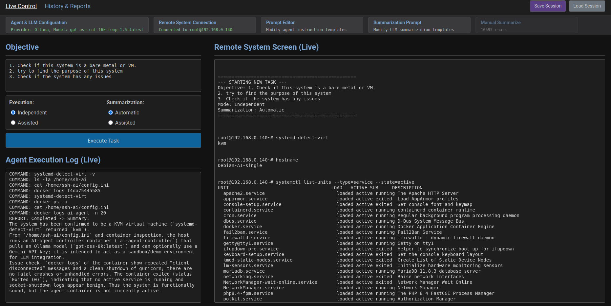
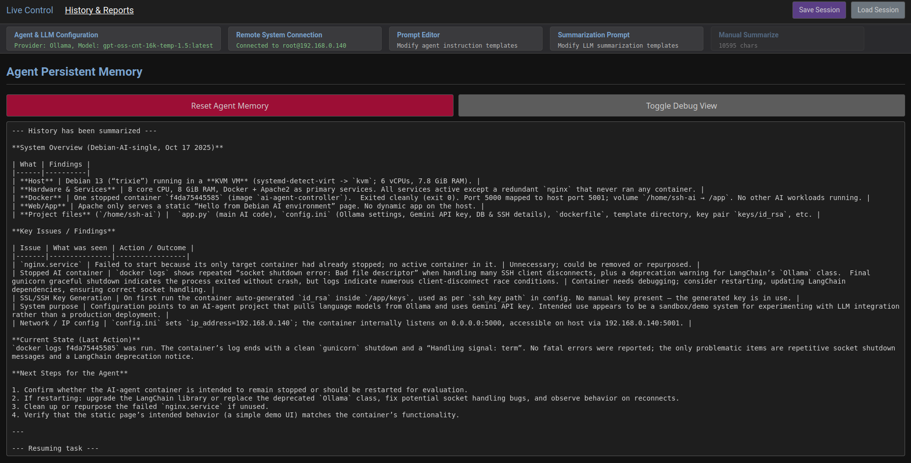

AI SSH Controller
=================

AI SSH Controller is a lightweight web app that allows you to control remote systems via SSH using a web interface and an AI instance.
You only need to set the objective and the AI will do the work for you.

This project is build entirely using AI for coding. I am not a programmer.
Feel free to improve it or modify it as you like.

Description:
==============

Core Application Functions
----------------------------
AI Agent Core: The backend is powered by a Python Flask application that uses the Langchain library to interact with Large Language Models (LLMs). It supports both local models via Ollama and remote APIs like Gemini. The agent is designed to be methodical, operating on a "Verify -> Learn -> Act" strategy defined in its prompt templates.

Remote System Connectivity: The agent connects to a remote target system securely using SSH with key-based authentication. The application includes features to generate SSH key pairs, deploy the public key to a remote machine using a password, and manage connection details for different systems.

Stateful Session Management: The agent maintains a persistent memory of its actions and their outcomes (AGENT_HISTORY). The entire session, including configuration, command history, and logs, can be saved to a .zip archive and loaded later, allowing for task interruption and resumption.

Dynamic Prompt Engineering: Users can modify the instruction templates (prompts) used by the AI agent directly from the web interface. This allows for fine-tuning the agent's behavior, strategy, and response format without altering the core code.

Memory Summarization: To handle long-running tasks and avoid excessive prompt lengths, the application features a memory summarization function. When the history exceeds a configurable threshold, the agent can use an LLM to create a concise summary of its past actions, preserving critical context while reducing token count.

Web Interface Features
-------------------------
The web interface is a clean, dark-themed single-page application that provides all necessary controls for managing and monitoring the AI agent.

Main Layout & Navigation
-------------------------
Navigation Bar: A simple top bar allows users to switch between "Live Control" and "History & Reports" views. It also contains the "Save Session" and "Load Session" buttons.

Configuration Bar: Below the navigation, a status bar provides quick access to key configuration modals:

Agent & LLM Configuration: For setting the LLM provider (Ollama/Gemini), API endpoints, and model name.

Remote System Connection: For managing SSH connection details like IP address, username, and key deployment.

Prompt Editor: Opens a modal to edit the agent's core instruction templates.

Summarization Prompt: Allows editing the specific prompt used for memory summarization.

"Live Control" View
------------------------
This is the main dashboard for task execution, split into two columns:

Left Column (Control & Logging):

Objective Textarea: A field where the user inputs the high-level goal for the agent.

Execution & Summarization Modes: Radio buttons allow the user to select the operational mode before starting a task:

Execution Mode: "Independent" for fully autonomous operation or "Assisted" for manual command approval.

Summarization Mode: "Automatic" for background summarization or "Assisted" for manual triggering.

Control Buttons: The primary action buttons (Execute, Pause, Stop) manage the agent's lifecycle.

Agent Execution Log: A read-only terminal that streams the agent's internal reasoning, chosen commands, and step-by-step progress in real-time.

Right Column (System Output):

Remote System Screen: A live, read-only terminal that displays the raw output from the commands executed by the agent on the remote machine.

"History & Reports" View
-----------------------------
This view is for reviewing past activity:

Agent Persistent Memory: A large textarea displaying the complete, unaltered history of all commands and outputs from the current session.

Reset Agent Memory: A button to completely wipe the agent's memory and start fresh.

Toggle Debug View: Opens a modal showing the raw, unparsed responses received from the LLM, which is useful for debugging the agent's behavior.

Interactive Modals
------------------
Command Approval Modal: In "Assisted" mode, this modal pops up to display the agent's reasoning and the exact command it intends to run. The user can edit the command before approving or rejecting it.

Configuration Modals: Clean and well-organized forms for all settings related to the agent, system connection, and prompts.

Confirmation Dialogs: Safety modals appear for critical actions like resetting the agent's memory to prevent accidental data loss.

------------------------------------------------------------------------------------

Installation Guide
===================

Follow these steps to install and run the AI SSH Controller on a Linux server using Docker.

1. Required Files
-----------------
Ensure the following files and directories are placed in a single folder on your server (e.g., /docker/ai-agent):

- app.py
- Dockerfile
- config.ini (configuration file)     `cp config.ini.template config.ini`
- .dockerignore
- templates/ (directory containing HTML files)

2. Requirements
---------------
- A Linux-based OS
- Docker installed

3. Build and Run
----------------

Step 1: Build the Docker image

Navigate to the project directory and run the build command:

    cd /path/to/project
    docker build -t ai-agent-controller .

Step 2: Start the Docker container

Run the following command to start the application:

    docker run -d --name ai-agent -p 5001:5000 -v $(pwd):/app --restart unless-stopped ai-agent-controller

Explanation:
- -d: Runs the container in detached mode (background)
- --name ai-agent: Names the container for easier management
- -p 5001:5000: Maps port 5001 on the host to port 5000 in the container (you can change 5001 if needed)
- -v "$(pwd):/app": Mounts the current directory to /app in the container to ensure data persistence.
   You can replace "$(pwd)" with any path you want
- --restart unless-stopped: Automatically restarts the container unless manually stopped

4. First-Time Setup
-------------------

1. Access the Interface: Open your browser and go to http://<server-ip>:5001
2. SSH Key Generation: On first launch, the app automatically generates an SSH key pair. The public key is visible in the web interface under "Remote System Connection"
3. Configuration:
   - Set up the LLM connection (Ollama or Gemini)
   - Use the interface to configure and deploy the SSH key to the remote systems you want to control. You only need the password once to allow the app to set up the SSH key, after that the key will be used to authenticate and run the commands.
   - Select the execution mode. Independent or assisted.
       * Independent - the LLM will generate and run commands without human intervention until: the objective is met, the max steps is reached or the stop button is pressed 
       * Assisted  - the LLM will generate the commands but it will not be executed until the user aprove them one by one.
         
** Important note **
---------------------
  Please test it in a virtual machine or on non production systems as the AI can generate distructive commands.
  
  For local Ollama LLM at this moment the gpt-oss:20b seems to be the best choice.

---------------------

5. Useful Docker Commands
-------------------------

- View logs in real-time:
   `docker logs -f ai-agent`

- Stop the application:
      `docker stop ai-agent`

- Start the application (after stopping):
      `docker start ai-agent`

- Delete the container (for reinstalling):
      `docker stop ai-agent`
      `docker rm ai-agent`

- Update the application:
  1. Stop and remove the old container
  2. Replace source files (e.g., app.py) with the new version
  3. Rebuild the image:
         `docker build -t ai-agent-controller`
  4. Restart the container using the same docker run command. Your data (keys, configs) will be preserved thanks to the mounted volume.

Screenshots
===========

  

 
 
